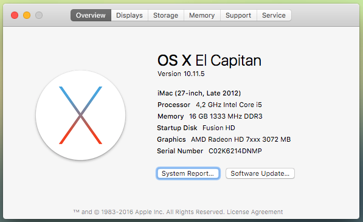

# Hackintosh Build | [Profile in Geekbench](http://browser.primatelabs.com/user/Kikobeats)



> * Gitabyte Z77-DS3H Rev1.1.
* Intel i5 3570K @ 4.2GHz.
* 2x8 DDR3 Corsair Vengeance 1600MHz.
* MSI Matrix 7970 @ R9 280x.

## BIOS

- Load optimized values.
- Set hard disk in AHCI mode


- Set memories in Profile1 (1600 MHz)


- Set your CPU overlock and disable EIST


## Clover

- Mount EFI Partition using Clover Configuration.
- Copy config.plist.zip or generate one:

```bash
/usr/local/bin/clover-genconfig > ~/Desktop/config.plist
```

- Modify based on the screens to adjust some values.
- Save at Clover path and reboot.

## Kexts

### Trim Enabler

See [Trim Enabler](https://www.macupdate.com/app/mac/37852/trim-enabler).

### Clover Audio Injection ALC887.

See [Clover ALC](https://github.com/toleda/audio_CloverALC) and [script command report](https://gist.github.com/Kikobeats/aca8a37cc9b0a1a625b7298df2187b8f).

### Atheros Driver

See [ALXEthernet](http://www.tonymacx86.com/resources/alxethernet.267/).

### USB3 Support

See [USBInjectAll](https://github.com/RehabMan/OS-X-USB-Inject-All) and [download page](https://bitbucket.org/RehabMan/os-x-usb-inject-all/downloads).

### Hardware Stats

See FakeSMC at [Multibeast](http://www.tonymacx86.com/resources/multibeast-el-capitan-8-2-3.319/).

## Benchmarks

- [LuxMarks](http://www.luxrender.net/wiki/LuxMark#Download).
- [Geekbench](http://browser.primatelabs.com/user/54544).

## Utils

* [Kext Utility](http://cvad-mac.narod.ru/index/0-4)
* [Clover Configurator](http://mackie100projects.altervista.org/).
